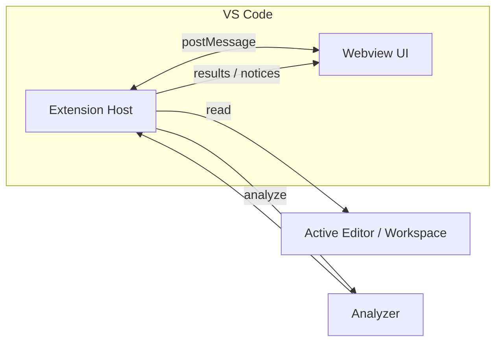

# CodeGraph

<p align="center">
  
</p>

<p align="center">
  VS Code extension + React webview for exploring TypeScript/JavaScript code as a graph.
</p>

---

## Overview

CodeGraph analyzes the active file in your workspace and renders:

- file, function, method, class, interface, type, enum, and external nodes
- call edges, reference edges, and parameter/data-flow edges
- inspector details, diagnostics, and trace mode playback

It is split into two parts:

- `src/`: VS Code extension host, workspace access, analysis, save dialogs
- `webview-ui/`: React + Vite graph UI rendered inside a VS Code webview

---

## Demo


## Debug Walkthrough


---

## Key Features

- Analyze the active TypeScript/JavaScript file and render an interactive graph
- Open source locations directly from graph nodes and inspector actions
- Trace mode to step through graph construction events
- Inspector panel with diagnostics, graph metadata, and node details
- Workspace file picker and graph search from the top bar
- `Fit to Screen` action in the top bar to reframe the graph viewport
- Export menu in the top bar with:
  - `JSON export`: saves graph data, active file info, analysis metadata, and current UI state
  - `JPG snapshot`: saves a JPEG image of the current graph canvas

---

## Export Formats

### JSON export

The JSON export is saved with a schema like:

```json
{
  "schema": "codegraph.flow.v1",
  "exportedAt": "2026-03-20T06:27:10.416Z",
  "ui": {
    "activeFilter": "all",
    "searchQuery": "",
    "rootNodeId": null,
    "selectedNodeId": null,
    "inspector": {
      "open": true,
      "placement": "right",
      "effectivePlacement": "right",
      "width": 370,
      "height": 396
    }
  },
  "activeFile": {
    "uri": "file:///path/to/file.ts",
    "fileName": "file.ts",
    "languageId": "typescript"
  },
  "analysisMeta": {
    "mode": "workspace"
  },
  "graph": {
    "nodes": [],
    "edges": []
  }
}
```

Use this when you want structured graph data for inspection, debugging, or future import/export workflows.

### JPG snapshot

The JPG export captures the current graph canvas as an image. This is useful for sharing the current graph view in docs, chat, or issues.

Notes:

- the export currently captures the graph canvas as rendered in the webview
- overlay controls such as zoom buttons and notices are filtered out from the snapshot
- this is a snapshot export, not a structured graph format

---

## Architecture



---

## Message Protocol

### Webview -> Extension

| Type | Description |
| --- | --- |
| `requestActiveFile` | Request current active editor info |
| `requestWorkspaceFiles` | Request workspace file list |
| `requestSelection` | Request current editor selection |
| `analyzeActiveFile` | Analyze active file |
| `selectWorkspaceFile` | Open a file from the workspace picker |
| `expandNode` | Analyze and merge graph data for an external file |
| `openLocation` | Reveal a code location in the editor |
| `saveExportFile` | Save a JSON or JPG export via VS Code save dialog |

### Extension -> Webview

| Type | Description |
| --- | --- |
| `activeFile` | Active editor payload |
| `workspaceFiles` | Workspace root and file list |
| `selection` | Current selection payload |
| `analysisResult` | Graph, diagnostics, trace, and metadata |
| `uiNotice` | Toast/canvas/inspector notice |
| `flowExportResult` | Result of JSON/JPG export save |

---

## Requirements

- Node.js 18+
- VS Code 1.108+

---

## Install

```bash
npm install
cd webview-ui
npm install
```

---

## Development

### Webview UI

```bash
cd webview-ui
npm run dev
```

### Build webview

```bash
cd webview-ui
npm run build
```

### Run extension

Open the repo in VS Code and press `F5` to launch an Extension Development Host.

---

## Build

Build everything from the repo root:

```bash
npm run build:all
```

This runs:

1. webview build
2. copy webview output into `media/webview`
3. extension TypeScript compile

---

## Repo Structure

```text
.
├─ src/                # VS Code extension source
├─ webview-ui/         # React + Vite webview UI
├─ media/webview/      # generated webview build output
├─ scripts/            # helper scripts
├─ assets/             # logos / demo images
├─ package.json
└─ README.md
```

---

## Current Graph Model

The analyzer currently emits a graph with:

```ts
type GraphPayload = {
  nodes: Array<{
    id: string;
    kind: "file" | "function" | "method" | "class" | "interface" | "external";
    name: string;
    file: string;
    parentId?: string;
    range: {
      start: { line: number; character: number };
      end: { line: number; character: number };
    };
    signature?: string;
    sig?: {
      params: Array<{ name: string; type: string; optional?: boolean }>;
      returnType?: string;
    };
    subkind?: "interface" | "type" | "enum";
  }>;
  edges: Array<{
    id: string;
    kind: "calls" | "constructs" | "dataflow" | "references";
    source: string;
    target: string;
    label?: string;
  }>;
};
```

---

## Roadmap

- [ ] export full graph bounds as an image, not only the current rendered canvas region
- [ ] add import support for previously exported JSON graph files
- [ ] improve analyzer precision for call graph and external references
- [ ] incremental analysis for larger workspaces
- [ ] optional PNG/SVG export presets
