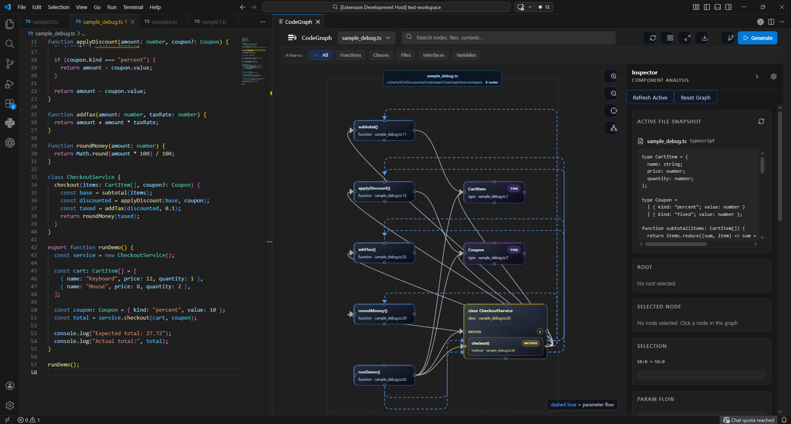
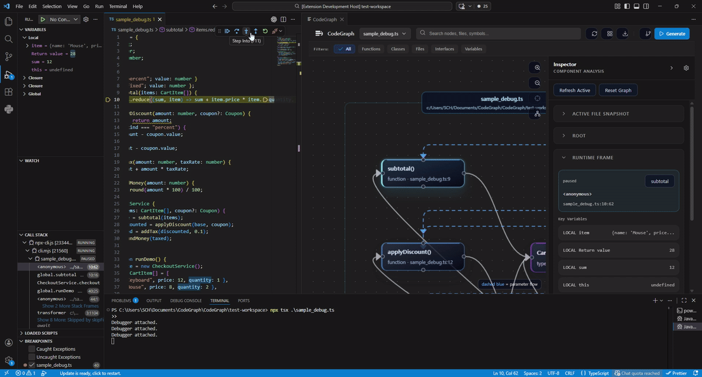
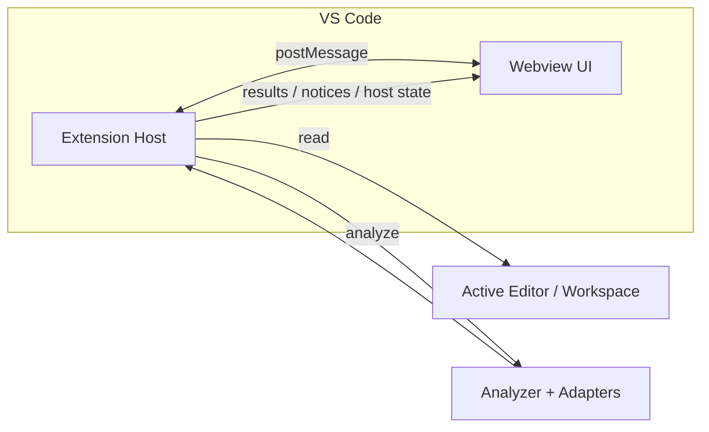

# Cogic

<p align="center">
  
</p>

<p align="center">
  VS Code 안에서 TypeScript/JavaScript 코드를 정적 분석하고, 그래프 형태로 탐색하기 위한 확장과 Webview UI입니다.
</p>

---

## 개요

Cogic는 현재 열려 있는 파일과 워크스페이스 파일들을 분석해 다음 정보를 그래프로 보여줍니다.

- 코드 엔티티: `file`, `function`, `method`, `class`, `interface`, `type`, `enum`, `external`
- 관계: `calls`, `constructs`, `references`, `updates`, `dataflow`
- 시각 계층: `folder -> child folder -> file -> symbol`

Cogic는 두 가지 호스트 모드를 지원합니다.

- `Sidebar View`: Activity Bar의 Cogic 컨테이너 안에서 열리는 사이드바 Webview
- `Editor Panel`: 일반 에디터 탭처럼 여는 독립 Webview 패널

프로젝트는 크게 두 부분으로 나뉩니다.

- `src/`: VS Code extension host, 워크스페이스 연동, 분석, 명령, 디버그 연계
- `webview-ui/`: React + Vite 기반 그래프 UI

---

## 주요 기능

- 활성 파일 또는 워크스페이스 기준 그래프 분석
- 폴더/파일/심볼 계층 렌더링
- `1 depth`, `2 depth` 확장 분석
- 노드 더블클릭 시 코드 위치 이동
- parameter flow 라벨과 Inspector 연동
- external node 확장
- root 고정
  - `file root`
  - `folder root`
- Sidebar / Editor Panel 하이브리드 호스트
- Inspector 내 설정 화면 전환
- Inspector 섹션 표시/숨김, 순서 변경, 드래그 정렬
- JSON / JPG export
- VS Code 디버그 프레임 연동
- Trace / Runtime Debug 모드
- Scaffold Lab
  - 폴더 우클릭: 파일/폴더 생성
  - 파일 우클릭: 함수/클래스/인터페이스/타입 등 생성

---

## 데모



## 노드 클릭 데모


## Trace 데모


## Runtime Debug 데모



## 에러 데모


---

## 열기 방식

### 명령어

- `Cogic: Open Editor Panel`
- `Cogic: Focus Sidebar View`

내부 command id는 다음과 같습니다.

- `codegraph.open`
- `codegraph.openSidebar`

### Activity Bar

확장은 `Cogic` Activity Bar 아이콘을 추가합니다. 이 아이콘을 누르면 사이드바 Webview가 열립니다.

---

## 그래프 모델

현재 analyzer는 아래 구조의 그래프 데이터를 생성합니다.

```ts
type GraphPayload = {
  nodes: Array<{
    id: string;
    kind: "file" | "function" | "method" | "class" | "interface" | "external";
    name: string;
    file: string;
    parentId?: string;
    range: {
      start: { line: number; character: number };
      end: { line: number; character: number };
    };
    signature?: string;
    sig?: {
      params: Array<{ name: string; type: string; optional?: boolean }>;
      returnType?: string;
    };
    subkind?: "interface" | "type" | "enum";
  }>;
  edges: Array<{
    id: string;
    kind: "calls" | "constructs" | "dataflow" | "references" | "updates";
    source: string;
    target: string;
    label?: string;
  }>;
};
```

참고:

- 폴더 그룹은 analyzer의 원본 graph node가 아니라 UI 레이아웃 계층입니다.
- depth 확장 시 많은 파일을 정리해서 보여주기 위해 폴더 계층이 추가됩니다.

---

## 캔버스 상호작용

### 노드와 그룹

- `Single click`: 노드 선택
- `Double click`: 코드 위치 열기
- 폴더/파일 그룹 클릭: 선택 + 접기/펼치기
- 폴더/파일이 열릴 때만 카메라가 해당 그룹을 따라감
- 폴더/파일이 닫힐 때는 카메라를 유지

### Top Bar

상단 바에서는 다음 기능을 사용할 수 있습니다.

- 활성 파일 선택
- depth 선택
- 그래프 검색
- refresh / reset
- 레이아웃 유틸리티
- export

### Parameter Flow

- `dataflow` 엣지를 별도 라벨로 표시
- 현재 활성 flow를 캔버스와 Inspector에서 함께 강조
- parameter flow 라벨은 일반 엣지보다 위에 표시
- Inspector / 캔버스 오버레이 패널은 그보다 더 위 레이어에 표시

---

## Inspector

Inspector는 상세 정보 패널이면서 동시에 설정 화면 역할도 합니다.

### Inspector 섹션

- `Active File Snapshot`
- `Root`
- `Runtime Frame`
- `Selected Node`
- `Selection`
- `Param Flow`
- `Analysis`

### Inspector 설정

설정 아이콘을 누르면 작은 메뉴 대신 Inspector 전체가 설정 화면으로 전환됩니다.

설정 화면에서 할 수 있는 일:

- Display Mode 변경
  - `Sidebar Left`
  - `Sidebar Right`
  - `Editor Panel`
- Inspector Position 변경
  - `Auto`
  - `Left`
  - `Right`
  - `Bottom`
- 섹션 표시/숨김
- 섹션 순서 변경
- 드래그로 섹션 재정렬

설정은 Webview 로컬 상태로 저장됩니다.

---

## Root

Root는 그래프 기준 대상을 고정하는 기능입니다.

- `file root`
  - 특정 파일을 기준으로 그래프를 고정
- `folder root`
  - 특정 폴더를 기준으로 그래프를 고정
  - 같은 폴더 안의 파일로 이동할 때만 자동 재렌더 허용

이 기능을 사용하면 다른 파일 심볼을 더블클릭해도 그래프 기준이 과하게 흔들리지 않도록 제어할 수 있습니다.

---

## Trace 모드

Trace 모드는 현재 그래프가 어떤 순서로 구성되었는지 보여주는 데 초점을 둡니다.

- 그래프 생성 이벤트를 단계적으로 재생
- 현재 trace 단계 노드 강조
- parameter flow trace 단계 시 flow 강조
- Inspector에 현재 trace 관련 정보 표시

그래프 생성 과정을 이해하거나 분석 로직을 검증할 때 유용합니다.

---

## Runtime Debug 모드

Runtime Debug 모드는 VS Code 디버거 상태와 연결됩니다.

- 현재 paused stack frame 수집
- `file/line` 기준으로 그래프 노드와 매핑
- runtime active node 강조
- Inspector에 frame / 변수 정보 표시
- Step Over / Step Into 중 그래프 포커스 갱신

### Trace 모드와 Debug 모드 차이

| 모드 | 보여주는 것 | 기준 데이터 | 용도 |
| --- | --- | --- | --- |
| `Trace Mode` | 그래프가 어떻게 만들어졌는지 | analyzer trace event | 분석 과정 이해 |
| `Debug Mode` | 현재 실행이 어디에 멈춰 있는지 | VS Code debugger 상태 | 런타임 흐름 확인 |

---

## Export

### JSON Export

JSON export에는 다음 정보가 포함됩니다.

- graph nodes / edges
- active file 정보
- analysis metadata
- filter, search query, selection, root, Inspector layout 같은 UI 상태

### JPG Snapshot

JPG export는 현재 보이는 그래프 캔버스를 이미지로 저장합니다.

참고:

- 구조화된 벡터 export가 아니라 렌더 결과 스냅샷입니다.
- 협업 공유, 문서, 발표 자료 첨부에 적합합니다.

---

## Scaffold Lab

Scaffold Lab은 그래프 컨텍스트에 따라 다른 생성 흐름을 제공합니다.

- 폴더 우클릭
  - `File`
  - `Folder`
- 파일 우클릭
  - `Function`
  - `Class`
  - `Interface`
  - `Type`
  - `Service + Repository`

Root가 잡혀 있으면 scaffold target은 root 기준을 우선합니다.

---

## Analyzer 확장 구조

최근 analyzer는 프레임워크 전용 로직을 공통 분석기에서 분리했습니다.

- 공통 분석기
  - AST 순회
  - 엔티티/엣지 생성
  - 워크스페이스 해석
- framework adapter
  - 특정 프레임워크의 패턴을 semantic node/edge로 승격

관련 경로:

- `src/analyzer/analyze.ts`
- `src/analyzer/adapters/`

### 기본 제공 adapter

- `react`
  - `useEffect`, `useMemo`, `useCallback`
  - `useState`, `useReducer`
- `vue`
  - `computed`, `watch`, `watchEffect`, `watchPostEffect`, `watchSyncEffect`
  - `ref`, `reactive`, `shallowRef`, `customRef`
  - `ref.value = ...`, `reactive.field += ...` 같은 업데이트 추적
- `express`
  - `app.get`, `app.post`, `app.use`
  - `router.get`, `router.post`
  - inline handler와 named handler route owner 노드 생성
- `nest`
  - `@Controller`, `@Get`, `@Post`, `@Patch` 등
  - controller method 위 route owner 노드 생성

### 예시

- React
  - `App.useEffect#1`
  - `App.useState#1`
- Vue
  - `useCounter.computed#1`
  - `useCounter.ref#1`
  - `useCounter.watch#1`
- Express
  - `registerRoutes.route.get:/users#1`
- Nest
  - `UsersController.route.get:/users#1`

---

## 테스트랩

Documents 아래에 프레임워크별 테스트랩 샘플을 함께 두고 있습니다.

- React: `C:\Users\SCH\Documents\CodeGraph-TestLab-REACT`
- Vue: `C:\Users\SCH\Documents\CodeGraph-TestLab-VUE`
- Express: `C:\Users\SCH\Documents\CodeGraph-TestLab-EXPRESS`
- Nest: `C:\Users\SCH\Documents\CodeGraph-TestLab-NEST`

권장 시작 파일:

- React: `src/app/App.tsx`
- Vue: `src/app/App.ts`
- Express: `src/server.ts`
- Nest: `src/modules/users/users.controller.ts`

---

## 메시지 프로토콜

### Webview -> Extension

| Type | 설명 |
| --- | --- |
| `requestActiveFile` | 현재 active editor 정보 요청 |
| `requestWorkspaceFiles` | workspace root / file list 요청 |
| `requestSelection` | 현재 editor selection 요청 |
| `requestHostState` | 현재 host kind와 sidebar 위치 요청 |
| `analyzeActiveFile` | 현재 active file 분석 |
| `analyzeWorkspace` | workspace 기준 분석 |
| `selectWorkspaceFile` | workspace picker에서 파일 열기 |
| `expandNode` | external file을 분석해서 현재 graph에 병합 |
| `setGraphDepth` | graph depth 변경 |
| `openLocation` | 코드 위치 열기 |
| `saveExportFile` | JSON/JPG export를 VS Code 저장 다이얼로그로 저장 |
| `switchHost` | sidebar / editor panel 전환 |

### Extension -> Webview

| Type | 설명 |
| --- | --- |
| `activeFile` | active editor payload |
| `workspaceFiles` | workspace root / file list |
| `selection` | 현재 selection payload |
| `analysisResult` | graph, diagnostics, trace, metadata |
| `runtimeDebug` | debug session, frame, variable snapshot |
| `hostState` | 현재 host kind와 sidebar 위치 |
| `uiNotice` | toast / canvas / inspector notice |
| `flowExportResult` | JSON/JPG export 결과 |

---

## 아키텍처



---

## 요구 사항

- Node.js 18+
- VS Code 1.108+

---

## 설치

```bash
npm install
cd webview-ui
npm install
```

---

## 개발

### Webview 빌드

```bash
cd webview-ui
npm run build
```

### 확장 실행

VS Code에서 이 저장소를 연 뒤 `F5`를 눌러 Extension Development Host를 실행합니다.

### 전체 빌드

```bash
npm run build:all
```

이 명령은 다음 순서로 실행됩니다.

1. Webview 빌드
2. `media/webview`로 복사
3. extension TypeScript compile

---

## 저장소 구조

```text
.
|-- src/                # VS Code extension source
|-- webview-ui/         # React + Vite webview UI
|-- media/webview/      # built webview output
|-- assets/             # logo, demo image
|-- scripts/            # helper scripts
|-- package.json
`-- README.md
```

---

## 현재 참고 사항

- 폴더 그룹은 analyzer 원본 graph schema가 아니라 UI 계층입니다.
- `Sidebar Right`는 Cogic만 따로 옮기는 방식이 아니라 VS Code sidebar 위치를 전환하는 방식입니다.
- sidebar host와 editor panel host는 둘 다 지원하지만, 서로 별도 웹뷰 호스트입니다.
- framework adapter는 계속 확장 가능한 구조이며, 현재는 React / Vue / Express / Nest를 기본 지원합니다.

---

## 로드맵

- [ ] graph import 지원
- [ ] 더 큰 workspace를 위한 incremental analysis
- [ ] route/controller/service 시각 강조 개선
- [ ] PNG / SVG 같은 추가 export preset
- [ ] framework adapter 추가 확장
  - Svelte
  - Fastify
  - Next.js server actions
